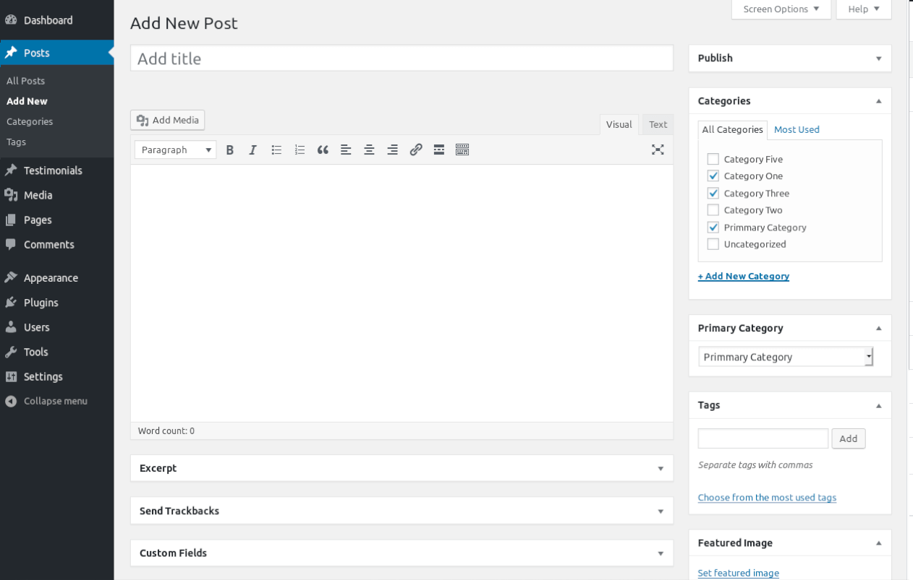
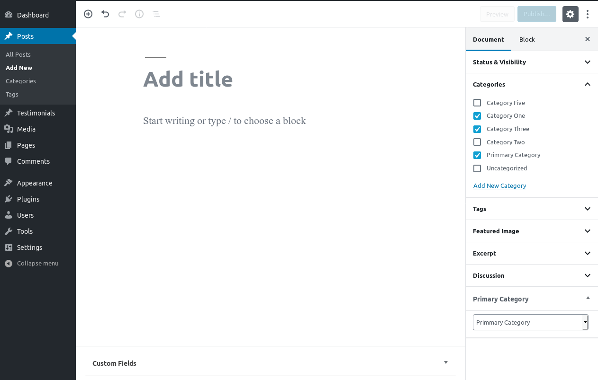

# Primary Category Selector

Contributors: ajithrn  
Donate link: https://ajithrn.com  
Tags: taxonomy, category, post  
Requires at least: 3.0.1  
Tested up to: 5.2  
Stable tag: 4.3  
License: GPLv2 or later  
License URI: http://www.gnu.org/licenses/gpl-2.0.html  
Ref: [1](https://wordpress.org/plugins/easy-primary-category/) | [2](https://github.com/airesvsg/wp-primary-category)

Plugin to select the primary category for post and custom post types.

## Description

Plugin to select primary category for post and custom post types.

## Installation

This section describes how to install the plugin and get it working.

e.g.

1. Upload `primary-category-selector.php` to the `/wp-content/plugins/` directory
1. Activate the plugin through the 'Plugins' menu in WordPress

## Screenshots

   classic editor | gutenberg editor
--- | ---
 | 

## Changelog

#### 1.0.0
* initial release.

## Known Bugs
- an issue with Gutenberg editor auto-populates primary category data while editing when there are more than one custom taxonomies.

## TO DO
- Improve Documentation
- Improve Gutenberg Support
- Front End Post List Block
- Add Setting Page
- REST API Support
